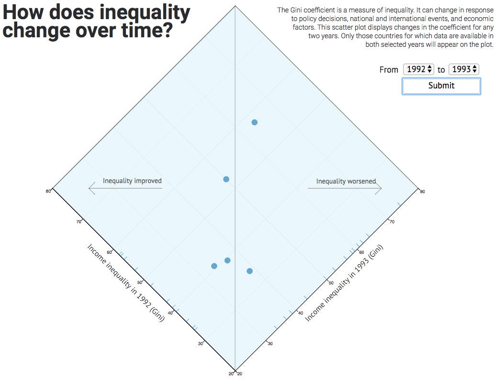

# A tool for displaying year-to-year changes in the Gini coefficient

### This visualization looks at Canada's Indian Residential School system -- a network of boarding schools and federal hostels throughout Canada from the mid 1800s until 1996 -- through the stories of survivors and the narrative of each school.

### Abstract
The Gini coefficient is a measure of inequality. The coeeficient can change in response to policy decisions, national and international events, and economic factors.

Line charts that visualize those changes for many states at a time are challenging to read. The goal of this project is to create a tool for displaying changes in the Gini coefficient between any two (consecutive or non-consecutive)
years.

[Treatment - In Progress (Markdown)](https://github.com/svickars/thesis/blob/master/writing/07_treatment.md)

### Features
* Scroll through immersive survivor stories, told through direct quotes, with accompanying contextual information
* Interact (pan, zoom, and click) with a full screen map, layered in steps with school locations, reservation locations, and the connections between
* Click on a school location to view fully interactive school narrative and demographic data when available
* Search for stories, reserves/tribes/bands, stories, or locations with autocomplete and best match

### Credits
Created by Julian H. Lange with data from the following sources:

* Truth and Reconciliation Canada. *The survivors speak: a report of the Truth and Reconciliation Commission of Canada*. Winnipeg: Truth and Reconciliation Commission of Canada., Publishers, 2015.
* The National Centre for Truth and Reconciliation at the University of Manitoba. Retrieved from [http://nctr.ca/](http://nctr.ca/)
* Howe, D. C. (2015). RiTa [Computer software]. Retrieved from [http://rednoise.org/rita](http://rednoise.org/rita)

### Featured images

