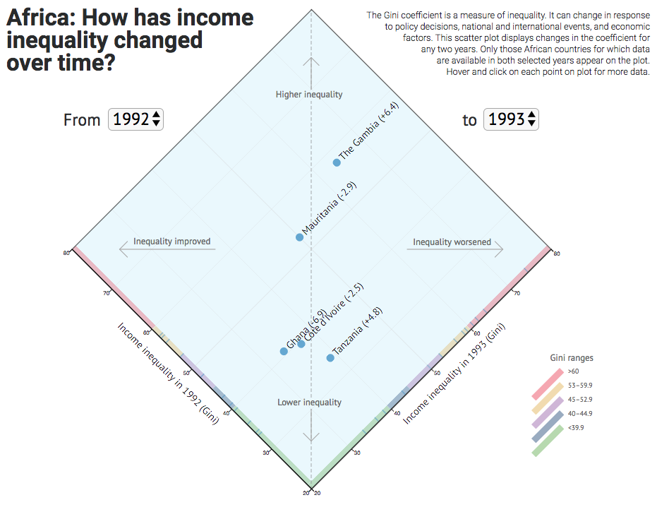

# Displaying changes in the Gini coefficient

### Abstract
The Gini coefficient is a measure of inequality. The coefficient can change in response to policy decisions, national and international events, and economic factors.
Line charts that visualize changes in the Gini score over time for many countries are challenging to read because lines that cross paths are difficult to follow.
This scatterplot tool displays changes in the Gini coefficient between any two years for all countries for which data are available in those two years.
The two years can be consecutive or non-consecutive.

### Features
* Select any two years between 1980 and 2016 to view the changes in Gini coefficient for all African countries for which data are available
* On the scatterplot, click on a country's dot to view all available data between 1980 and 2016

### Credits
Created by Julian H. Lange with data from the following sources:

* Gini data are from UNU-WIDER World Income Inequality Database revision 3.4 (WIID3.4). Retrieved November 2017 from [https://www.wider.unu.edu](https://www.wider.unu.edu/project/wiid-world-income-inequality-database).
* Data were curated with R version 3.3.1. Retrieved from [http://www.r-project.org](http://www.r-project.org).

